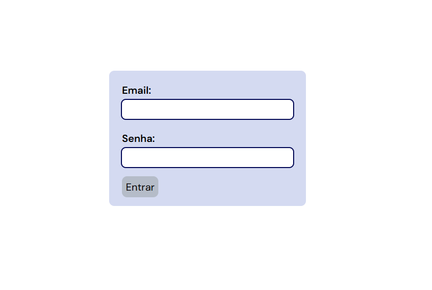
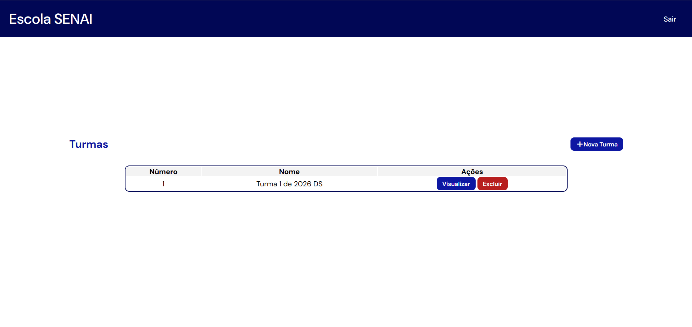
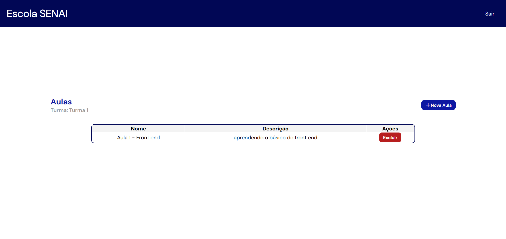
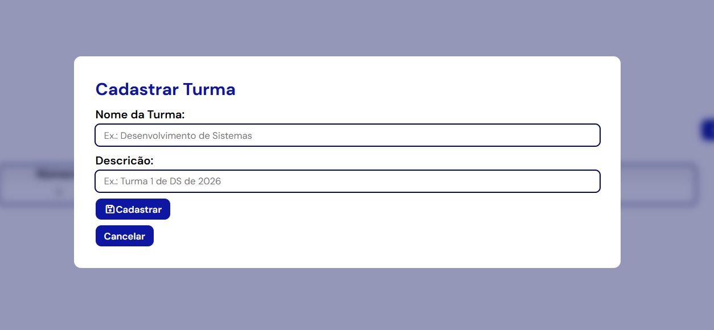

# Escola avaliacao

## Detalhes

1. Editor IDE:
   VSCode. 
2. SGBD:
   XAMPP - MySQL
3. Servidor de Aplicação e versão:
   Node.JS v26
4. Linguagens e versões:
   HTML5, CSS3, JavaScript, SQL.
---
## Como testar o aplicativo
1. Nesse repositório, cliqe no botão azul `Code` e copie o link https;
2. Abra o terminal no lugar que preferir e digite `git clone` + o link copiado;
3. Quando a pasta carregar, acesse os arquivos e abra com o VSCode;
4. Para rodar o back-end há duas maneiras:
    a) Se estiver na pasta "escolaavaliacao", digite no terminal `cd api` e dê enter. Ao checar que está dentro da pasta correta, basta rodar o server por `npm run dev` ou `node server.js`;
    b) Se já estiver na pasta API, basta rodar o server usando um dos comandos anteriores (`npm run dev` ou `node server.js`).
5. Quando o server estiver rodando, abra a pasta web, clique com o botão direito na página `index.htm` e em "Open with live server" ou `Alt+L Alt+O`. A extensão "Live Server" deve estar baixada.
---
## Print das telas

| Login  | Tela inicial  | Tela de aulas  | Exemplo do modal  |
|---|---|---|---|
|   |   |   |   |
